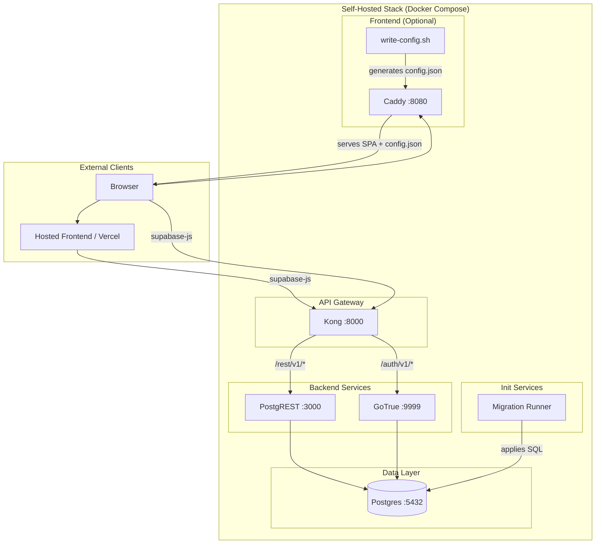
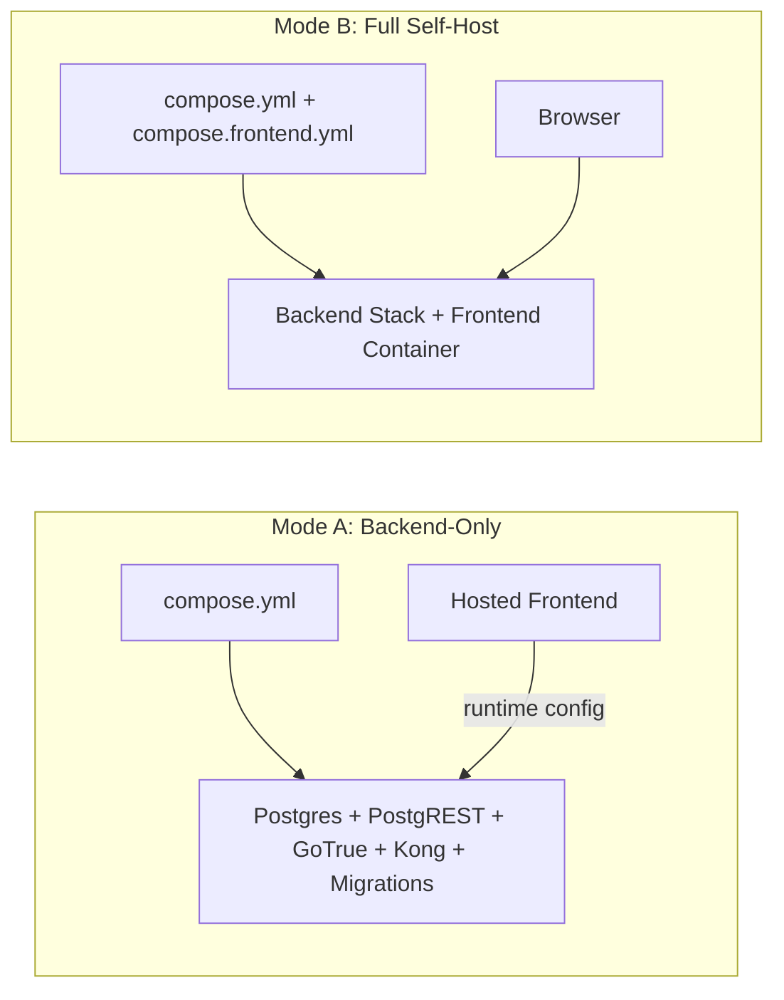
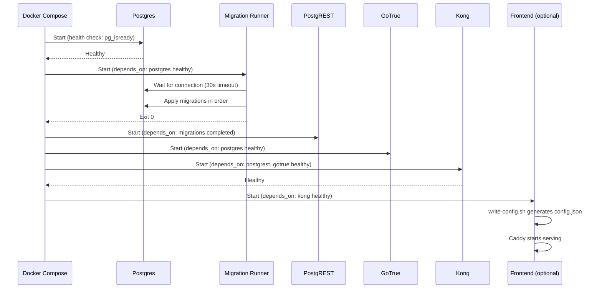

# Design Document: Self-Hosting

## Overview

This design describes the architecture for adding self-hosting support to SimpleBudget. The system enables two deployment modes:

1. **Backend-only self-hosting** — Users run their own Supabase-compatible backend (Postgres, PostgREST, GoTrue, Kong) via Docker Compose while continuing to use the hosted Vercel frontend.
2. **Full self-hosting** — Users run the entire stack including the frontend served via Caddy, all through Docker Compose.

The design preserves the existing Vercel deployment path unchanged. The frontend uses a runtime configuration priority chain (localStorage → config.json → build-time env vars) so that no rebuild is required when switching backends.

### Key Design Decisions

- **Docker Compose as the deployment primitive**: Compose provides a single-command experience for starting all services with dependency ordering and health checks.
- **Compose override pattern for frontend**: The frontend is an optional layer (`compose.frontend.yml`) that extends the base backend stack, keeping the two modes cleanly separated.
- **Runtime config.json over build-time injection**: A shell script generates `config.json` at container startup from environment variables, avoiding frontend rebuilds.
- **psql-based migration runner**: A lightweight Alpine container with `psql` applies migrations directly, avoiding the weight of the full Supabase CLI in production.
- **Kong as the API gateway**: Matches Supabase's architecture — Kong routes `/rest/v1` to PostgREST and `/auth/v1` to GoTrue, providing a single entry point for supabase-js.

## Architecture

### System Architecture Diagram



### Deployment Modes



### Service Startup Order



## Components and Interfaces

### 1. Docker Compose Base Stack (`deploy/compose.yml`)

**Responsibility**: Defines and orchestrates all backend services.

**Services**:

| Service | Image | Port | Health Check |
|---------|-------|------|--------------|
| postgres | supabase/postgres:15 | 5432 (internal) | `pg_isready -U postgres` |
| postgrest | postgrest/postgrest | 3000 (internal) | HTTP GET `/` returns 200 |
| gotrue | supabase/gotrue | 9999 (internal) | HTTP GET `/health` returns 200 |
| kong | kong:3 | 8000 (exposed) | HTTP GET `/` returns non-5xx |
| migrations | postgres:15-alpine (psql) | — | Exits with code 0 |

**Interfaces**:
- Reads environment variables from `.env` file
- Exposes Kong on `${SUPABASE_PUBLIC_URL}` (default port 8000)
- Kong routes: `/rest/v1/*` → PostgREST, `/auth/v1/*` → GoTrue

### 2. Migration Runner Service

**Responsibility**: Applies SQL migrations from `supabase/migrations/` to Postgres.

**Interface**:
```
Input:  POSTGRES_PASSWORD, database connection details
Mount:  ./supabase/migrations:/migrations (read-only)
Output: Exit code 0 (success) or non-zero (failure)
Stderr: Error details including failing filename on failure
```

**Behavior**:
- Polls Postgres with `pg_isready` every 1 second for up to 30 seconds
- Creates a `schema_migrations` tracking table if not exists
- Applies each `.sql` file in lexicographic order, skipping already-applied files
- Wraps each migration in a transaction for atomicity
- Stops on first failure, reports filename and error

### 3. Secret Generator (`deploy/scripts/generate-secrets.sh`)

**Responsibility**: Populates missing secret values in the `.env` file.

**Interface**:
```
Input:  .env file in working directory
Output: Modified .env file with generated values
Stdout: Summary of generated vs. existing keys
Exit:   0 on success, non-zero on error
```

**Dependencies**: `openssl`, `base64` (validated at startup)

**Generation Logic**:
- `POSTGRES_PASSWORD`: 32-char random alphanumeric via `openssl rand`
- `JWT_SECRET`: 32-char random alphanumeric via `openssl rand`
- `DASHBOARD_PASSWORD`: 32-char random alphanumeric via `openssl rand`
- `ANON_KEY`: JWT with `{"role":"anon","iss":"supabase","iat":<now>,"exp":<now+10y>}` signed HS256 with `JWT_SECRET`
- `SERVICE_ROLE_KEY`: JWT with `{"role":"service_role","iss":"supabase","iat":<now>,"exp":<now+10y>}` signed HS256 with `JWT_SECRET`

### 4. Frontend Container (`Dockerfile` + `deploy/compose.frontend.yml`)

**Responsibility**: Builds and serves the React SPA with runtime configuration.

**Interface**:
```
Build Input:  Source code (src/, public/, package.json)
Runtime Input: SUPABASE_PUBLIC_URL, ANON_KEY (env vars)
Output:        HTTP server on FRONTEND_PORT (default 8080)
```

**Stages**:
1. **Build stage** (node:22-alpine): `npm ci` + `npm run build` → produces `/app/dist`
2. **Runtime stage** (caddy:2-alpine): Serves static files, generates `config.json` at startup

### 5. Config Writer (`deploy/scripts/write-config.sh`)

**Responsibility**: Generates runtime `config.json` from environment variables.

**Interface**:
```
Input:  SUPABASE_PUBLIC_URL, ANON_KEY (environment variables)
Output: /usr/share/caddy/config.json
Exit:   0 on success, non-zero if required vars missing
```

**Output format**:
```json
{
  "supabaseUrl": "${SUPABASE_PUBLIC_URL}",
  "supabaseAnonKey": "${ANON_KEY}"
}
```

### 6. Caddy Configuration (`deploy/Caddyfile`)

**Responsibility**: Serves the React SPA with proper routing.

**Behavior**:
- Serves static files from `/usr/share/caddy`
- Falls back to `index.html` for any path not matching a static file (SPA routing)
- Listens on port 80 inside the container (mapped to `FRONTEND_PORT` externally)

### 7. Frontend Configuration Priority (Runtime)

**Responsibility**: The React app resolves Supabase connection details at initialization.

**Priority chain** (highest to lowest):
1. `localStorage` values (`supabaseUrl`, `supabaseAnonKey`)
2. `config.json` fetched at startup (if present and valid)
3. Build-time environment variables (`VITE_SUPABASE_URL`, `VITE_SUPABASE_ANON_KEY`)

### 8. Environment Variable Template (`deploy/.env.example`)

**Responsibility**: Documents all configuration with sensible defaults.

**Structure**:
```env
# === Public (browser-safe) ===
SUPABASE_PUBLIC_URL=http://localhost:8000
ANON_KEY=

# === Private (backend-only) ===
SERVICE_ROLE_KEY=
JWT_SECRET=
POSTGRES_PASSWORD=

# === Optional ===
DASHBOARD_USERNAME=admin
DASHBOARD_PASSWORD=

# === Frontend ===
FRONTEND_PORT=8080
```

## Data Models

### Runtime Configuration (`config.json`)

```typescript
interface RuntimeConfig {
  supabaseUrl: string;      // e.g. "http://localhost:8000"
  supabaseAnonKey: string;  // JWT with role=anon
}
```

### Environment Variables Schema

| Variable | Type | Default | Scope | Required |
|----------|------|---------|-------|----------|
| SUPABASE_PUBLIC_URL | URL string | `http://localhost:8000` | Public | Yes |
| ANON_KEY | JWT string | (generated) | Public | Yes |
| SERVICE_ROLE_KEY | JWT string | (generated) | Private | Yes |
| JWT_SECRET | string (32-64 chars) | (generated) | Private | Yes |
| POSTGRES_PASSWORD | string (32-64 chars) | (generated) | Private | Yes |
| DASHBOARD_USERNAME | string | `admin` | Private | No |
| DASHBOARD_PASSWORD | string (32-64 chars) | (generated) | Private | No |
| FRONTEND_PORT | integer | `8080` | Public | No |

### JWT Token Structure

```typescript
interface SupabaseJWT {
  role: "anon" | "service_role";
  iss: "supabase";
  iat: number;  // Unix timestamp (seconds)
  exp: number;  // Unix timestamp (at least 10 years from iat)
}
```

### Migration Tracking Table

```sql
CREATE TABLE IF NOT EXISTS schema_migrations (
  filename TEXT PRIMARY KEY,
  applied_at TIMESTAMPTZ DEFAULT NOW()
);
```

### Kong Route Configuration

```yaml
services:
  - name: rest
    url: http://postgrest:3000
    routes:
      - paths: ["/rest/v1/"]
        strip_path: true
    plugins:
      - name: jwt
        config:
          key_claim_name: role
          
  - name: auth
    url: http://gotrue:9999
    routes:
      - paths: ["/auth/v1/"]
        strip_path: true
```

## Correctness Properties

*A property is a characteristic or behavior that should hold true across all valid executions of a system — essentially, a formal statement about what the system should do. Properties serve as the bridge between human-readable specifications and machine-verifiable correctness guarantees.*

### Property 1: Migration ordering

*For any* set of SQL migration files in the `supabase/migrations/` directory, the Migration Runner SHALL apply them in strict lexicographic filename order, such that for any two files A and B where A < B lexicographically, A is applied before B.

**Validates: Requirements 2.3**

### Property 2: Migration idempotence

*For any* set of SQL migrations that have been successfully applied, running the Migration Runner again SHALL produce no changes to the database and SHALL exit with code 0 — i.e., `apply(apply(migrations)) == apply(migrations)`.

**Validates: Requirements 2.4**

### Property 3: JWT generation round-trip

*For any* generated JWT_SECRET (32-64 alphanumeric characters), the ANON_KEY and SERVICE_ROLE_KEY produced by the Secret Generator SHALL decode successfully using that JWT_SECRET with HS256 verification, and the decoded payload SHALL contain the correct `role` ("anon" or "service_role"), `iss` ("supabase"), a valid `iat` (current timestamp), and an `exp` at least 10 years in the future.

**Validates: Requirements 3.2, 3.3**

### Property 4: Secret generator preserves existing and fills missing

*For any* `.env` file containing an arbitrary subset of the required keys (POSTGRES_PASSWORD, JWT_SECRET, SERVICE_ROLE_KEY, ANON_KEY, DASHBOARD_PASSWORD) with non-empty values, running the Secret Generator SHALL preserve all pre-existing values unchanged AND populate all missing keys with non-empty values.

**Validates: Requirements 3.1, 3.4**

### Property 5: Generated secrets format constraints

*For any* execution of the Secret Generator, all generated password/secret values (POSTGRES_PASSWORD, JWT_SECRET, DASHBOARD_PASSWORD) SHALL be alphanumeric strings with length between 32 and 64 characters inclusive.

**Validates: Requirements 3.5, 3.6, 3.9**

### Property 6: Config writer produces correct and minimal output

*For any* valid SUPABASE_PUBLIC_URL (HTTP/HTTPS URL) and ANON_KEY (non-empty string), the Config Writer SHALL produce a JSON file containing exactly two keys — `supabaseUrl` equal to SUPABASE_PUBLIC_URL and `supabaseAnonKey` equal to ANON_KEY — with no additional keys.

**Validates: Requirements 5.1, 7.1, 7.3**

### Property 7: Frontend config priority chain

*For any* combination of localStorage values, Runtime_Config (config.json) values, and build-time environment variables, the frontend SHALL resolve Supabase connection details using strict priority: localStorage > config.json > build-time env vars. If a higher-priority source provides a non-empty value, lower-priority sources SHALL be ignored.

**Validates: Requirements 5.2, 5.3, 5.4, 6.1, 6.2**

### Property 8: Invalid URL rejection

*For any* string that is not a valid HTTP or HTTPS URL (e.g., missing protocol, ftp://, empty string, malformed), the frontend SHALL reject it as a SUPABASE_PUBLIC_URL configuration and SHALL NOT attempt to initialize supabase-js with that value.

**Validates: Requirements 6.4**

### Property 9: SPA routing fallback

*For any* HTTP request path that does not match an existing static file in the Caddy serving directory, the Frontend Container SHALL respond with the contents of `index.html` and HTTP status 200.

**Validates: Requirements 4.3**

## Error Handling

### Backend Stack Errors

| Error Condition | Behavior | User Visibility |
|----------------|----------|-----------------|
| Postgres fails health check (60s) | Dependent services don't start | Docker Compose logs show Postgres failure |
| PostgREST/GoTrue/Kong fails health check | Service marked unhealthy | Docker Compose logs identify failed service |
| Kong unreachable | supabase-js requests fail | Frontend shows connection error |

### Migration Runner Errors

| Error Condition | Behavior | User Visibility |
|----------------|----------|-----------------|
| Postgres connection timeout (30s) | Exit non-zero | Stderr: connection timeout message |
| SQL syntax error in migration | Stop, exit non-zero | Stderr: filename + SQL error details |
| Empty migrations directory | Exit 0 (success) | No output (normal operation) |

### Secret Generator Errors

| Error Condition | Behavior | User Visibility |
|----------------|----------|-----------------|
| Missing .env file | Exit non-zero | Stderr: ".env file not found" |
| Missing dependency (openssl/base64) | Exit non-zero | Stderr: "missing dependency: <name>" |
| Partial generation (interrupted) | Already-written values preserved | Re-run fills remaining values |

### Config Writer Errors

| Error Condition | Behavior | User Visibility |
|----------------|----------|-----------------|
| SUPABASE_PUBLIC_URL missing/empty | Exit non-zero, Caddy doesn't start | Stderr: "SUPABASE_PUBLIC_URL is required" |
| ANON_KEY missing/empty | Exit non-zero, Caddy doesn't start | Stderr: "ANON_KEY is required" |

### Frontend Configuration Errors

| Error Condition | Behavior | User Visibility |
|----------------|----------|-----------------|
| config.json not found (404) | Fall back to build-time vars | Silent (expected on Vercel) |
| config.json malformed/empty | Fall back to build-time vars | Console warning logged |
| Invalid URL in localStorage | Reject, show error | Error message displayed to user |
| Backend unreachable | supabase-js requests fail | Connection error in UI |

## Testing Strategy

### Unit Tests

Unit tests cover specific examples, edge cases, and error conditions:

**Secret Generator (`generate-secrets.sh`)**:
- Missing .env file → error exit
- Missing openssl dependency → error exit with dependency name
- Empty .env file → all keys generated
- Full .env file → no values changed
- Partial .env file → only missing keys filled

**Config Writer (`write-config.sh`)**:
- Missing SUPABASE_PUBLIC_URL → error exit
- Missing ANON_KEY → error exit
- Valid inputs → correct JSON output

**Migration Runner**:
- Empty migrations directory → exit 0
- Postgres unavailable for 30s → timeout error
- Invalid SQL file → stops with filename in error
- Already-applied migrations → no re-application

**Frontend Config Resolution**:
- No config sources → uses build-time defaults
- Only config.json → uses config.json values
- localStorage + config.json → localStorage wins
- Malformed config.json → falls back with console warning
- Invalid URL format → shows error, doesn't connect

### Property-Based Tests

Property-based tests verify universal properties across generated inputs. Each property test runs a minimum of 100 iterations.

**Library**: [fast-check](https://github.com/dubzzz/fast-check) (JavaScript/TypeScript)

| Property | Test Description | Tag |
|----------|-----------------|-----|
| 1 | Generate random filename sets, verify lexicographic application order | Feature: self-hosting, Property 1: Migration ordering |
| 2 | Apply migrations, re-apply, verify idempotence | Feature: self-hosting, Property 2: Migration idempotence |
| 3 | Generate random secrets, produce JWTs, verify decode round-trip | Feature: self-hosting, Property 3: JWT generation round-trip |
| 4 | Generate random .env subsets, run generator, verify preservation + fill | Feature: self-hosting, Property 4: Secret generator preserves existing and fills missing |
| 5 | Run generator, verify all passwords match format constraints | Feature: self-hosting, Property 5: Generated secrets format constraints |
| 6 | Generate random URL/key pairs, run config writer, verify output structure | Feature: self-hosting, Property 6: Config writer produces correct and minimal output |
| 7 | Generate random config source combinations, verify priority resolution | Feature: self-hosting, Property 7: Frontend config priority chain |
| 8 | Generate random invalid URL strings, verify all rejected | Feature: self-hosting, Property 8: Invalid URL rejection |
| 9 | Generate random non-file paths, verify index.html fallback | Feature: self-hosting, Property 9: SPA routing fallback |

### Integration Tests

Integration tests verify the full Docker Compose stack behavior:

- Backend stack starts and all services reach healthy state
- Kong routes `/rest/v1/` to PostgREST and `/auth/v1/` to GoTrue
- Migration runner applies migrations on first start
- Frontend container serves SPA on configured port
- config.json is accessible and contains correct values
- Hosted frontend can connect to self-hosted backend via configured URL

### Smoke Tests

Smoke tests verify static configuration correctness:

- `.env.example` contains all required keys with correct defaults
- `.env.example` leaves secrets empty
- `compose.frontend.yml` only passes safe env vars to frontend
- `.gitignore` includes `.env`
- `package.json` does not reference deploy/ or Dockerfile
- `docs/self-hosting.md` contains all required sections

